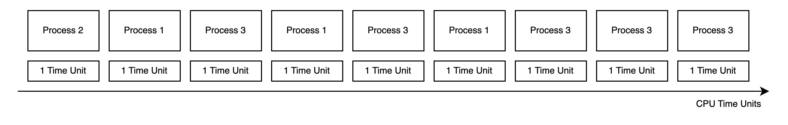
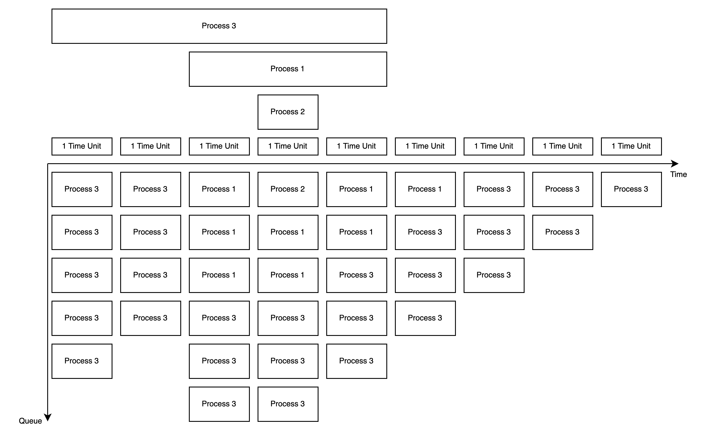
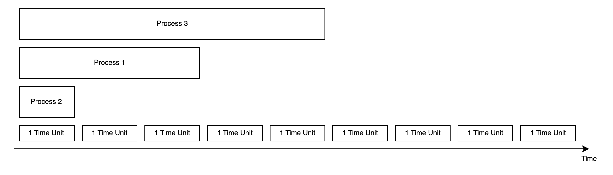
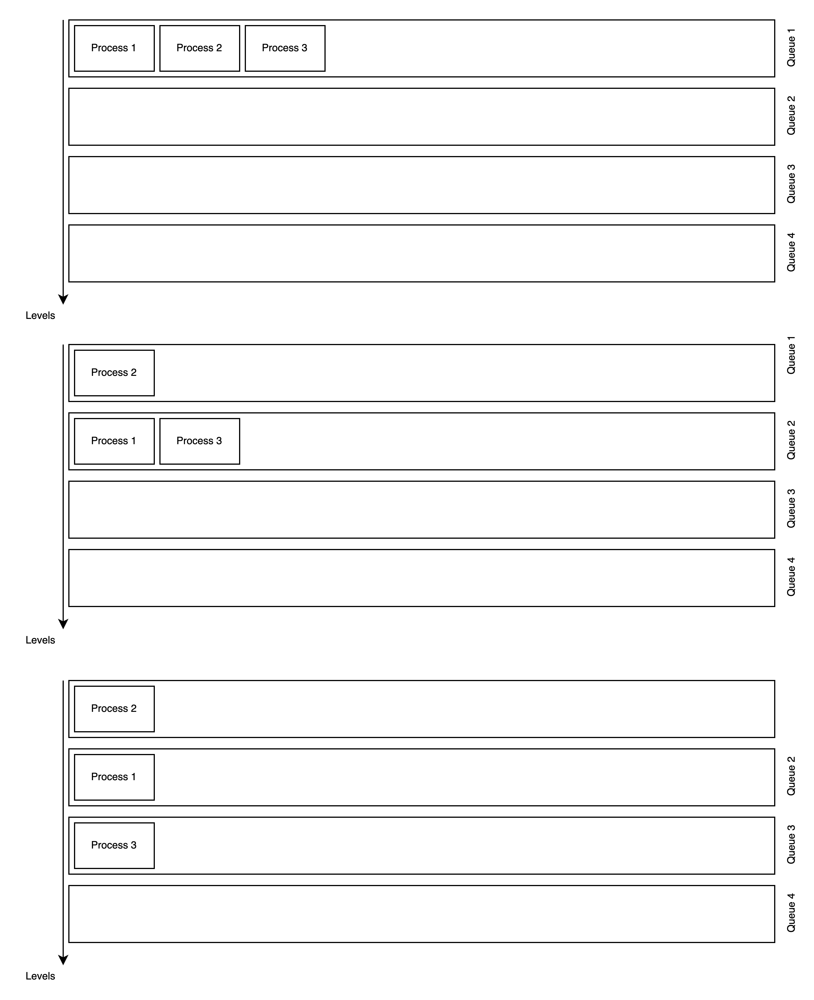
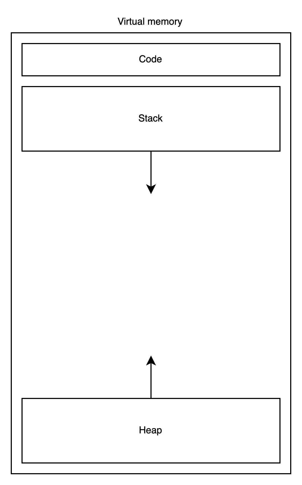
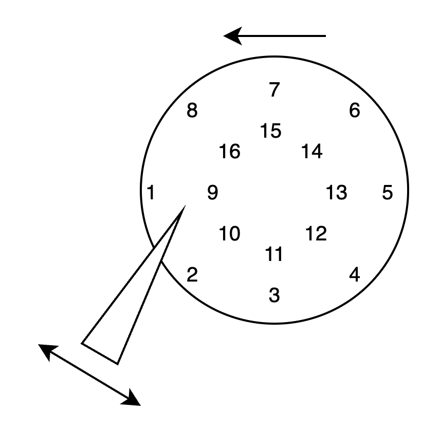
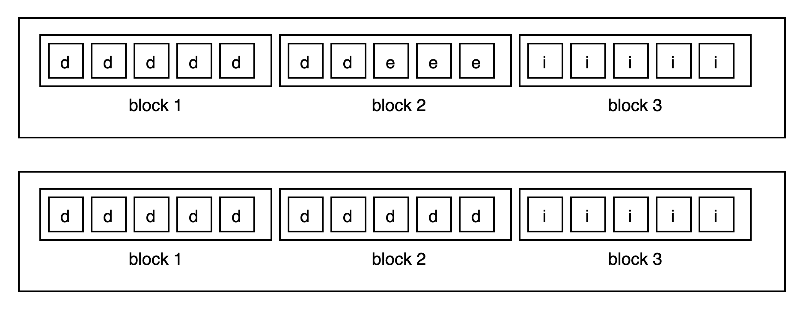
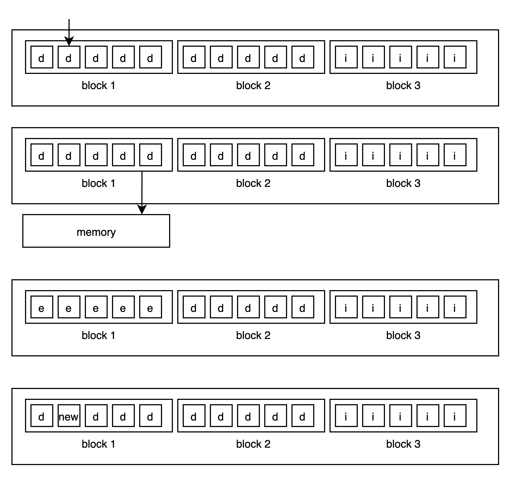

# OS Design

## Table of Contents

- 1. System Requirements.
  - 1.1. Functional.
  - 1.2. Non Functional.
- 2. Approaches with tradeoffs.
- 3. Virtualization.
  - 3.1. CPU virtualization.
    - 3.1.1. How exactly will programs be executed using time-sharing mechanism?
    - 3.1.2. What are policies/rules for this?
    - 3.1.3. How effective will it be? How to measure effectiveness?
  - 3.2. Memory virtualization.
- 4. Concurrency.
  - 4.1. Basic synchronization mechanisms.
  - 4.2. Typical problems.
- 5. Durable storage.
  - 5.1. How HDD works?
  - 5.2. How SSD works?
  - 5.3. File systems.
  - 5.4. RAID.

## 1. System Requirements

Here is some overview. Lets say that no OS exist on Earth.
And you, as time traveler, know all the benefits an OS can give. What are they?
Knowing them, please, convince everybody that creating OS is necessary.

We can talk about several system types:

- Real-time.
- Embedded.
- General purpose.

For now let's concentrate on creating general purpose system.

### 1.1. Functional

- Computer should run several processes.
  - To be able to create software for different levels.
    (i.o user can use browser, but browser don't have to know about drivers and stuff).
  - To be able to utilize resources more efficiently.
  - To be able to be used simultaneously by several users.
- Each process should be treated equally.
  - Similar policies should be applied to each process.
  - Equal processor's time.
  - Equal memory allocation management.
- Overall system should have good balance between being interactive and efficient.
- System should be able to store data somehow.
  - Let's say we have both HDDs and SSDs available.
- System should be able to work with different kind of devices attached.
- Several users should be able to work with system via commandline interface.

### 1.2. Non Functional

- Security
  - Processes should not affect each other in any way.
    - Can't read/write other memory.
    - Can't steal processor's time.
    - Can't abuse system workflow any other way.
  - Users should not access each other's files.
- Performance
  - Resources utilization should be maximized.
  - System should be highly interactive.
- Reliability
  - Saved files should not be lost.
  - System must be transparent of what it does.

## 2. Approaches with tradeoffs.

What approaches do we have? Why modern operational systems use virtualization?

- 1. Bare metal programming.
  - **Description**: No operating system layer. Runs one program at a time.
  - **Examples**: Embedded systems' firmware, bootloaders, BIOS/UEFI implementation.
  - **Limitations**: No hardware abstractions. No resource sharing.
  Difficult to develop. Requires specialized knowledge of hardware.
- 2. Single-program operating environments.
  - **Description**: Simple OS which can run only one program at a time.
  - **Examples**: MS DOS, early gaming consoles' operating systems.
  - **Limitations**: Cannot run applications simultaneously.
  Inefficient resourse utilization and limited hardware abstractions.
- 3. Cooperative multitasking with direct memory access
  - **Description**: Program volanteers to give control over resources to other programs.
  - **Examples**: Early Mac Os, Windows 3.x.
  - **Limitations**: Security considerations. Program can capture resources and never give them back.

## 3. Virtualization.

Here, we will talk about preemptive multitasking with memory protection. It has some kind of hardware abstraction, but it is different from the full virtualization provided by VMWare, VirtualBox, or Hyper-V. In this document, the word virtualization refers to the basic hardware abstraction layer present in all modern operating systems.

Virtualization is when we provide a program with virtual resources rather than with physical.
Physical resources are being used through an abstration layer with some perks.

### 3.1. CPU virtualization

Let's say we have single core cpu. It can process only one program at a time.
So to be able to virtualize it and share single cpu across all programs we need to create time-sharing system.

Now, there is a number of problems:

1. How exactly will programs be executed using time-sharing mechanism?
   How will context switch happen?
1. What are policies/rules for this?
1. How effective will it be? How to measure effectiveness?

Let's start with the first one.

### 3.1.1. How exactly will programs be executed using time-sharing mechanism?

So if we have a time-sharing mechanism it is obvious that programs will be executed consequently.
The only question is how exactly?

#### Straight approach.

Simple idea is to execute programs one by one. This approach is displayed on the picture below.

It has several drawbacks:

- 1. It is not interactive at all.
     It process 2 is terminal command than we will have to wait until process 1 is finished.
     Only after that we can see the output. It doesn't meet requirements.
- 2. It has security issues. Process may acquire CPU and never finish.

Although, it also has some advantages.

- 1. If we know how long proces would take, system becomes predictable.
- 2. Processes are executed faster as we will see in measurement section.

#### System planner approach.

As we saw before, letting processes finish by themselves is not a good idea.
So in this approach some system planner will finish them periodically
and pass the ability to use the CPU to other process.

So now, process only has 1 time unit of time.
It doesn't matter whether it finished or not, it will be stopped when time exceeds
as it shown on the picture below.

It has its drawback:

- 1. Finish time of let's say process 1 is equal of 6 TU instead of 3 TU in simple approach.
- 2. Has context switch overhead.

The advantages are the following:

- 1. Pretty secure approach. System planner is responsible for context switch.
- 2. A way more interactive. But it needs to apply a careful policy of how to arrange processes.

#### How context switch happens?

During execution we have several registers. Program Counter is one of them.
It contains number of current line we should execute.
So what system should do during context switch is simple:

1. Copy all the registers to memory.
2. Clear all the registers' values to prevent security issues.
3. Copy all the registers of other process from memory.
4. Mark the time.
5. Execute context switch handler of process, so it began to run.

#### Why program can't read/write system registers like PC?

System has hardware support. CPU has several modes/rings: user and system.
On load system has system mode enabled. 
Before passing control to program, system enables user mode.
In user mode there are some restrictions for reading/writing registers or memory.

### 3.1.2. What are policies/rules for this?

Now, there is the question: how we can determine which process to run next?

#### Round Robin (RR).

Here system planner takes processes in order they came. And then executes it one by one.

Advantages:

- 1. Simple logic
- 2. Very fair. Each process gets equal CPU time units.

Drawbacks:

- 1. Inefficient turnaround time. Process 1 finishes in 6 TU instead of 3 TU.
- 2. Not so interactive. Response time is bounded by `number_of_processes * 1 TU`.
- 3. No priority consideration.

#### Shortest job first (SJF).

Here we need to know the time execution of process.
It is a bit of magic, but let's say system knows it.
Now, system can take shortest job as soon it arrives.

Picture below looks almost identical to FIFO, except order of processes.
Now first comes the shortest.

Another schema with queue state:

Advantages:

- 1. The most interactive approach.

Drawbacks:

- 1. Inefficient turnaround time. Process 1 finishes in 6 TU instead of 3 TU.
     And it can take way more if we have lots of short processes coming.
- 2. Not fair at all. Longer the process, less time it gets.
- 3. No priority consideration as well.

#### Multilevel Feedback Queues (MLFQ).

So, as we saw earlier, we have this tradeoff between interactivity and fairness.
What we do really want is good enough system for both cases, so we need to create workaround.

Multilevel Feedback Queues approach is based on several queues. Each queue has its percentage of process time guaranteed.
Let's say that 3 tasks came in same time.

At first all tasks go into first level queue.

Each level has its time limits for execution. If process exceeds level's time limit it goes down.
Let's say that in level 1 each process has 100ms time limit.
Each other level will have twice more time then previous: level 2 - 200ms, level 3 - 400ms, level 4 - 800ms.

Now if process 3 takes more than 100ms it goes down. Then if it takes more than 200ms it goes down again.

But what about processors time guaranteed?
We can start a lottery for example, each level will have proportional number of tickets.
If we want 60%-25%-10%-5% then we will give 60 tickets to first level.
The winner is chosen randomly.

The last problem this approach has is that the most time-consuming process will have the least processor's time.
To approach this problem, we will simply add all the tasks back to the first level periodically.
The time period should be chosen carefully:
too big intervals will make processes longer, too short intervals will make this approach similar to Round Robin.

### 3.1.3. How effective will it be? How to measure effectiveness?

We can calculate two numbers:

- 1. Turnaround time: how much time takes to finish task,
     including all context switches and time taken by other processes.
     Calculated like this `T_ta = global_finish_time - global_start_time`.
     It measures the performance of long processes.
- 2. Response time: how quickly process is provided with cpu after it is created.
     Calculated like this `T_r = global_create_time - global_start_time`.
     It measures how interactive system is.

For our approaches, they will be the following:

| | RR | SJF | MLFQ |
|--|--|--|--|
| Turnaround time | Excellent | Bad | Good |
| Response time | Bad | Excellent | Good |

As we can see, now system has well-balanced approach.

### 3.2. Memory virtualization.

So, we have time-sharing mechanism for CPU. Now we need to think a bit about memory.
We want each program to have separate memory, so that programs won't interfere. 
We also want to use all the physical memory available.

Here comes virtual memory. System will give each process virtual memory with the size of physical or even bigger.

Let's clarify what do we need to store as well. To run programs system needs code, stack and heap.
Code size is constant, while stack and heap are growing. 
So if we have an address space it seams a good idea to locate stack and heap on the different sides of it.

We have declared an abstraction, which will be used by the programs.
Now we need to implement it efficiently.

## 4. Concurrency.

Previously, we talked about single CPU, while in real world we have several.
So let's expand this abstraction. What problems arise?

Now, we have to think about parallel access to memory from different CPUs.
To make it possible system should have some synchronization mechanisms like locks and semaphores.

### 4.1. Basic synchronization mechanisms.

Atomicity.

## 5. Durable storage.

System has ability to use memory and several CPUs. 
Now it needs to store data somehow, 
so it could load everything after shutdown or after unexpected power problem.

There are several ways of storing data. 
Operating system is responsible for communication with phycical devices and data organisation inside them.

### 5.1. How HDD works?

HDD (Hard Disk Drive) is magnetic storage device. It consists of two parts: platter and head.
The platter is rotating disk, it rotates with constant speed.
The head reads and writes data, it also moves between tracks which is called seek.

As you can see, HDD is very fast to read/write sequential data, while random reads/writes will be very slow.
This should be taking into account when designing file systems.

### 5.2. How SSD works?

SSD (Solid-State Drive) is nonmechanical storage device. It consists of blocks of NAND. 
At first it seams quite similar to RAM but it is not.

We have several operations available:

- Read
- Write
- Clean block

As you can see we can't really delete data in the middle of the block. 
Instead we need to read all data from block. Clean block and then write changed data.
This should be taking into account when designing file systems as well.

Here we have several examples. Let's say we have block of size 5 bytes, and whole ssd consists of 3 blocks.
Some notation:

- d - data
- e - empty
- i - is not defined

Below is shown simple write of 3 bytes. We had 3 empty bytes in second block so it's okay

Now let's rewrite second byte of block 1. 
For this we need to copy whole block to memory and erase it.
Then we write whole block with data, with renewed byte 2.

### 5.3. File systems.

### 5.4. RAID.
