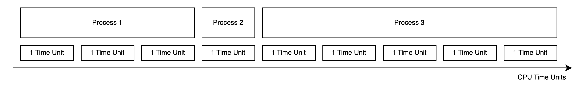
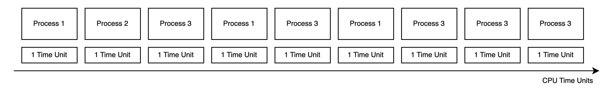

# OS Design

## Table of Contents

- 1. System Requirements.
  - 1.1. Functional.
  - 1.2. Non Functional.
- 2. Approaches with tradeoffs.
- 3. Virtualization.
  - 3.1. CPU virtualization.
    - 3.1.1. How exactly will programs be executed using time-sharing mechanism?
  - 3.2. Memory virtualization.
- 4. Concurrency.
  - 4.1. Basic synchronization mechanisms.
  - 4.2. Typical problems.
- 5. Durable storage.
  - 5.1. File systems.
  - 5.2. RAID.
  - 5.3. How HDD works?
  - 5.4. How SSD works?

## 1. System Requirements

Here is some overview. Lets say that no OS exist on Earth.
And you, as time traveler, know all the benefits an OS can give. What are they?
Knowing them, please, convince everybody that creating OS is necessary.

We can talk about several system types:

- Real-time.
- Embedded.
- General purpose.

For now let's concentrate on creating general purpose system.

### 1.1. Functional

- Computer should run several processes.
  - To be able to create software for different levels.
    (i.o user can use browser, but browser don't have to know about drivers and stuff).
  - To be able to utilize resources more efficiently.
  - To be able to be used simultaneously by several users.
- Each process should be treated equally.
  - Similar policies should be applied to each process.
  - Equal processor's time.
  - Equal memory allocation management.
- Overall system should have good balance between being interactive and efficient.
- System should be able to store data somehow.
  - Let's say we have both HDDs and SSDs available.
- System should be able to work with different kind of devices attached.
- Several users should be able to work with system via commandline interface.

### 1.2. Non Functional

- Security
  - Processes should not affect each other in any way.
    - Can't read/write other memory.
    - Can't steal processor's time.
    - Can't abuse system workflow any other way.
  - Users should not access each other's files.
- Performance
  - Resources utilization should be maximized.
  - System should be highly interactive.
- Reliability
  - Saved files should not be lost.
  - System must be transparent of what it does.

## 2. Approaches with tradeoffs.

What approaches do we have? Why modern operational systems use virtualization?

- 1. Bare metal programming
  - **Description**: aa
  - **Examples**: aa
  - **Limitations**: aa
- 2. Single-program operating environments
- 3. Cooperative multitasking with direct memory access
  - **Description**: Program volanteers to give control over resources to other programs.
  - **Examples**: Early Mac Os, Windows 3.x.
  - **Limitations**: Security considerations. Program can capture resources and never give them back.

## 3. Virtualization.

Virtualization is when we provide a program with virtual resources rather than with physical.
Physical resources are being used through an abstration layer with some perks.

### 3.1. CPU virtualization

Let's say we have single core cpu. It can process only one program at a time.
So to be able to virtualize it and share single cpu across all programs we need to create time-sharing system.

Now, there is a number of problems:

1. How exactly will programs be executed using time-sharing mechanism?
   How will context switch happen?
1. What are policies/rules for this?
1. How effective will it be? How to measure effectiveness?

Let's start with the first one.

### 3.1.1 How exactly will programs be executed using time-sharing mechanism?

So if we have a time-sharing mechanism it is obvious that programs will be executed consequently.
The only question is how exactly?

#### Straight approach.

Simple idea is to execute programs one by one. This approach is displayed on the picture below.

It has several drawbacks:

- 1. It is not interactive at all.
     It process 2 is terminal command than we will have to wait until process 1 is finished.
     Only after that we can see the output. It doesn't meet requirements.
- 2. It has security issues. Process may acquire CPU and never finish.

Although, it also has some advantages.

- 1. If we know how long proces would take, system becomes predictable.
- 2. Processes are executed faster as we will see in measurement section.

#### Planning daemon approach.

As we saw before, letting processes finish by themselves is not a good idea.
So in this approach some system daemon will finish them periodically
and pass the ability to use the CPU to other process.

So now, process only has 1 time unit of time.
It doesn't matter whether it finished or not, it will be stopped when time exceeds as it shown on the picture below.

It has its drawback:

- 1. Finish time of let's say process 1 is equal of 6 TU instead of 3 TU in simple approach.

The advantages are the following:

- 1. Pretty secure approach. System daemon is responsible for context switch.
- 2. A way more interactive. But it needs to apply a careful policy of how to arrange processes.

How context switch happens?

During execution we have several registers. Program Counter is one of them. It contains number of current line we should execute. So what system should do during context switch is simple:

1. Copy all the registers to memory.
1. Clear all the registers' values to prevent security issues.
1. Copy all the registers of other process from memory.
1. Mark the time.
1. Execute context switch handler of process, so it began to run.

### 3.1.2 What are policies/rules for this?

Now, there is the question: how we can determine which process to run next?

#### FIFO Policy
