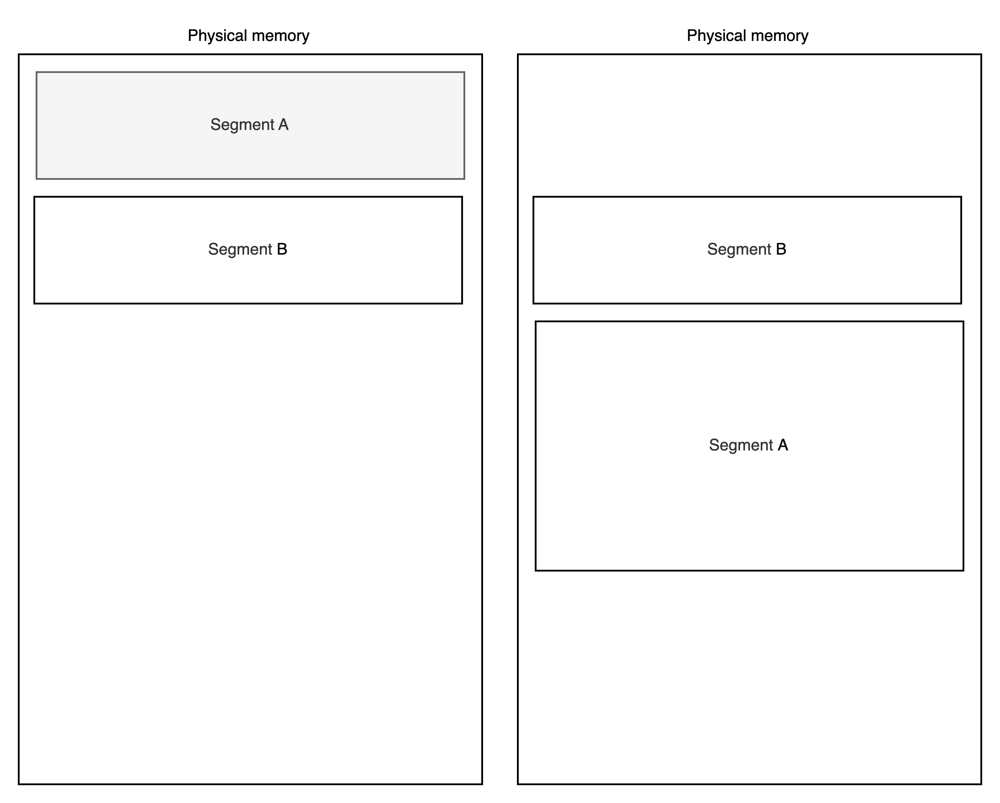

# OS Design

## Table of Contents

- 1. System Requirements.
  - 1.1. Functional.
  - 1.2. Non Functional.
- 2. Approaches with tradeoffs.
- 3. Virtualization.
  - 3.1. CPU virtualization.
    - 3.1.1. How exactly will programs be executed using a time-sharing mechanism?
    - 3.1.2. What are the policies/rules for this?
    - 3.1.3. How effective will it be? How to measure effectiveness?
  - 3.2. Memory virtualization.
    - 3.2.1. Addresses conversion.
    - 3.2.2. Segmentation.
    - 3.2.3. Paging.
    - 3.2.4. Segmentation combined with paging.
    - 3.2.5. TLB.
- 4. Concurrency.
  - 4.1. Basic synchronization mechanisms.
  - 4.2. Typical problems.
- 5. Durable storage.
  - 5.1. How does HDD work?
  - 5.2. How does SSD work?
  - 5.3. File systems.
    - 5.3.1. Basic implementation.
    - 5.3.2. Failsafe implementation.
    - 5.3.3. Physical devices considerations.
  - 5.4. RAID.

## 1. System Requirements

Here is some overview. Let's say that no OS exist on Earth.
And you, as time traveler, know all the benefits an OS can give. What are they?
Knowing them, please, convince everybody that creating OS is necessary.

We can talk about several system types:

- Real-time.
- Embedded.
- General purpose.

For now, let's concentrate on creating a general purpose system.

### 1.1. Functional

- Computer should run several processes.
  - To be able to create software for different levels.
    (i.o user can use browser, but browser don't have to know about drivers and stuff).
  - To be able to utilize resources more efficiently.
  - To be able to be used simultaneously by several users.
- Each process should be treated equally.
  - Similar policies should be applied to each process.
  - Equal processor's time.
  - Equal memory allocation management.
- The overall system should have good balance between being interactive and efficient.
- System should be able to store data somehow.
  - Let's say we have both HDDs and SSDs available.
- System should be able to work with different kind of devices attached.
- Several users should be able to work with system via commandline interface.

### 1.2. Non Functional

- Security
  - Processes should not affect each other in any way.
    - Can't read/write other memory.
    - Can't steal processor's time.
    - Can't abuse system workflow any other way.
  - Users should not access each other's files.
- Performance
  - Resources utilization should be maximized.
  - System should be highly interactive.
- Reliability
  - Saved files should not be lost.
  - System must be transparent of what it does.

## 2. Approaches with tradeoffs.

What approaches do we have? Why modern operational systems use virtualization?

- 1. Bare metal programming.
  - **Description**: No operating system layer. Runs one program at a time.
  - **Examples**: Embedded systems' firmware, bootloaders, BIOS/UEFI implementation.
  - **Limitations**: No hardware abstractions. No resource sharing.
    Difficult to develop. Requires specialized knowledge of hardware.
- 2. Single-program operating environments.
  - **Description**: Simple OS which can run only one program at a time.
  - **Examples**: MS DOS, early gaming consoles' operating systems.
  - **Limitations**: Cannot run applications simultaneously.
    Inefficient resourse utilization and limited hardware abstractions.
- 3. Cooperative multitasking with direct memory access
  - **Description**: Program volanteers to give control over resources to other programs.
  - **Examples**: Early Mac Os, Windows 3.x.
  - **Limitations**: Security considerations. Program can capture resources and never give them back.

## 3. Virtualization.

Here, we will talk about preemptive multitasking with memory protection. It has some kind of hardware abstraction, but it is different from the full virtualization provided by VMWare, VirtualBox, or Hyper-V. In this document, the word virtualization refers to the basic hardware abstraction layer present in all modern operating systems.

Virtualization is when we provide a program with virtual resources rather than with physical.
Physical resources are being used through an abstration layer with some perks.

### 3.1. CPU virtualization

Let's say we have single core cpu. It can process only one program at a time.
So to be able to virtualize it and share single cpu across all programs we need to create time-sharing system.

Now, there is a number of problems:

1. How exactly will programs be executed using time-sharing mechanism?
   How will context switch happen?
1. What are policies/rules for this?
1. How effective will it be? How to measure effectiveness?

Let's start with the first one.

### 3.1.1. How exactly will programs be executed using time-sharing mechanism?

So if we have a time-sharing mechanism it is obvious that programs will be executed consequently.
The only question is how exactly?

#### Straight approach.

Simple idea is to execute programs one by one. This approach is displayed on the picture below.


It has several drawbacks:

- 1. It is not interactive at all.
     It process 2 is terminal command than we will have to wait until process 1 is finished.
     Only after that we can see the output. It doesn't meet requirements.
- 2. It has security issues. Process may acquire CPU and never finish.

Although, it also has some advantages.

- 1. If we know how long proces would take, system becomes predictable.
- 2. Processes are executed faster as we will see in measurement section.

#### System planner approach.

As we saw before, letting processes finish by themselves is not a good idea.
So in this approach some system planner will finish them periodically
and pass the ability to use the CPU to other process.

So now, process only has 1 time unit of time.
It doesn't matter whether it finished or not, it will be stopped when time exceeds
as it shown on the picture below.


It has its drawback:

- 1. Finish time of let's say process 1 is equal of 6 TU instead of 3 TU in simple approach.
- 2. Has context switch overhead.

The advantages are the following:

- 1. Pretty secure approach. System planner is responsible for context switch.
- 2. A way more interactive. But it needs to apply a careful policy of how to arrange processes.

#### How context switch happens?

During execution we have several registers. Program Counter is one of them.
It contains number of current line we should execute.
So what system should do during context switch is simple:

1. Copy all the registers to memory.
1. Clear all the registers' values to prevent security issues.
1. Copy all the registers of other process from memory.
1. Mark the time.
1. Execute context switch handler of process, so it began to run.

#### Why program can't read/write system registers like PC?

System has hardware support. CPU has several modes/rings: user and system.
On load system has system mode enabled.
Before passing control to program, system enables user mode.
In user mode there are some restrictions for reading/writing registers or memory.

### 3.1.2. What are policies/rules for this?

Now, there is the question: how we can determine which process to run next?

#### Round Robin (RR).

Here system planner takes processes in order they came. And then executes it one by one.


Advantages:

- 1. Simple logic
- 2. Very fair. Each process gets equal CPU time units.

Drawbacks:

- 1. Inefficient turnaround time. Process 1 finishes in 6 TU instead of 3 TU.
- 2. Not so interactive. Response time is bounded by `number_of_processes * 1 TU`.
- 3. No priority consideration.

#### Shortest job first (SJF).

Here we need to know the time execution of process.
It is a bit of magic, but let's say system knows it.
Now, system can take shortest job as soon it arrives.

Picture below looks almost identical to FIFO, except order of processes.
Now first comes the shortest.


Another schema with queue state:


Advantages:

- 1. The most interactive approach.

Drawbacks:

- 1. Inefficient turnaround time. Process 1 finishes in 6 TU instead of 3 TU.
     And it can take way more if we have lots of short processes coming.
- 2. Not fair at all. Longer the process, less time it gets.
- 3. No priority consideration as well.

#### Multilevel Feedback Queues (MLFQ).

So, as we saw earlier, we have this tradeoff between interactivity and fairness.
What we do really want is good enough system for both cases, so we need to create workaround.

Multilevel Feedback Queues approach is based on several queues. Each queue has its percentage of process time guaranteed.
Let's say that 3 tasks came in same time.


At first all tasks go into first level queue.


Each level has its time limits for execution. If process exceeds level's time limit it goes down.
Let's say that in level 1 each process has 100ms time limit.
Each other level will have twice more time then previous: level 2 - 200ms, level 3 - 400ms, level 4 - 800ms.

Now if process 3 takes more than 100ms it goes down. Then if it takes more than 200ms it goes down again.

But what about processors time guaranteed?
We can start a lottery for example, each level will have proportional number of tickets.
If we want 60%-25%-10%-5% then we will give 60 tickets to first level.
The winner is chosen randomly.

The last problem this approach has is that the most time-consuming process will have the least processor's time.
To approach this problem, we will simply add all the tasks back to the first level periodically.
The time period should be chosen carefully:
too big intervals will make processes longer, too short intervals will make this approach similar to Round Robin.

### 3.1.3. How effective will it be? How to measure effectiveness?

We can calculate two numbers:

- 1. Turnaround time: how much time takes to finish task,
     including all context switches and time taken by other processes.
     Calculated like this `T_ta = global_finish_time - global_start_time`.
     It measures the performance of long processes.
- 2. Response time: how quickly process is provided with cpu after it is created.
     Calculated like this `T_r = global_create_time - global_start_time`.
     It measures how interactive system is.

For our approaches, they will be the following:

| | RR | SJF | MLFQ |
|--|--|--|--|
| Turnaround time | Excellent | Bad | Good |
| Response time | Bad | Excellent | Good |

As we can see, now system has well-balanced approach.

### 3.2. Memory virtualization.

So, we have time-sharing mechanism for CPU. Now we need to think a bit about memory.
We want each program to have separate memory, so that programs won't interfere.
We also want to use all the physical memory available.

Here comes virtual memory. System will give each process virtual memory with the size of physical or even bigger.

Let's clarify what do we need to store as well. To run programs system needs code, stack and heap.
Code size is constant, while stack and heap are growing.
Heap will be used for storing variables with global scope, and programs can also allocate raw memory in the heap. Other variables will be stored on stack. 
So if we have an address space, it seems a good idea to locate stack and heap on the different sides of it as they both grow and we need to store them grouped to avoid overcomplicated system.


We have declared an abstraction, which will be used by the programs.
Now, we need to implement it efficiently.

### 3.2.1. Addresses conversion.

To virtualize memory, we need to provide each process with a virtual memory size of physical. 
Then, after the process tries to allocate it, the system will convert the address of the virtual memory cell to the physical memory frame.

Let's agree on the minimum memory the program can allocate. I think it is not reasonable to store less than 1 byte. 
Now we can calculate how much memory we need to store a single address to 1 byte in our address space. 

Adress length depends on overall available memory. Let's say we have 16 bytes of RAM. 
If we address a single byte, we only have 16 possible addresses from 0 to 15. 
So the last address is 15, which is 1111 in binary. 
In bytes our address will take half of byte or 4 bits. 
As you can see, in bits, it equals log2 of number of addresses.

Let's consider a more real example. Now RAM will be 1 GB.

```
1 GB = 2^10 MB = 2^20 KB = 2^30 bytes
```

The system has 2^30 number of bytes. So the address of the last byte is 2^30 - 1. Address will have a size of 30 bits. 
We can calculate how much space we need to store all the possible addresses to map virtual  memory cells to physical ones. 
This will be equal to 3840 MB `(30 * 2^30 bits)`, which is way more than RAM. So we can't really store simple bytes mapping somewhere. 

### 3.2.2. Segmentation.

Okay, now we now that some sophisticated mechanism is needed. What can we do?
We can store memory by segments: code, stack and heap. 
System will store address of the base and offset in registers for each segment inside each process.
But it will face another problem: stack will no longer be consequent memory part as each program has it's own stack and heap and they grow.



If a segment grows and there is no space ahead, the system finds a place where it can be moved.
To be able to find it more quickly it can use free lists to track unused memory regions. 
This is called segment table and it stores protection flags as well (read, write, execute).
If system doesn't find region then it stops the process.

Finding region is declared by policies:

- First-fit: use first hole large enough to satisfy the request.
- Best-fit: use the smallest hole that's large enough.
- Worst-fit: use the largest available hole.
- Next-fit: like first-fit but starts searching from where the last allocation ended.

This approach has several big issues:

1. External fragmentation. 
There are many small regions between segments that are not big enough to fit other segments.
2. Miltiple memory accesses before getting target data.

### 3.2.3. Paging.

Another simple idea is to allocate more space. 
We can define what is the minimum size a program can allocate. This region is called page.
Each virtual page will correspond to physica frame with same size.
So, the translation table need to store much less information.

Let's go back to our example with 1 GB of RAM. Now we will allocate 4 KB which is normal page size.
Number of pages will be the following:

```
1 GB / 4 KB = 0.25 * 2^20
```

The address size will be:

```
log2(0.25 * 2^20) = 18 bits
```

So the total weight of translation table will be:

```
18 bits * 0.25 * 2^20 = 4718592 bits = 576 KB
```

This shows that increasing allocation size decreased translation table size significantly.

This approach has some drawbacks as well:

1. Internal segmentation. Too large pages will waste free space.
2. Miltiple memory accesses before getting target data.
3. External fragmentation. While allocating large memory regions works better than segmentation system still experiences this problem.

### 3.2.4. Segmentation combined with paging.

Both appoaches above can be combined to get more of each. 
Segmentation provides programs with logical structure while paging increases performance.
Segmentation also provides system with fine-grained protection: different segments can have different protection attributes 
(read/write/execute).

The address of virtual memory will have the following structure:

```
ADDRESS = Segment number + VPN (Virtual Page Number) + Offset
```

VPN is converted to PFN (Physical Frame Number) and after that offset is applied.

### 3.2.5. TLB.

We still have problem when for single read from memory we need to perform multiple reads
(read from segments table, read from PT (page table), read from PFN with offset). 
Each memory read is far more slower than register read, approximately 10 times slower.
We need some mechanism to increase speed.

Let's use cache, which is called TLB (translation lookaside buffer). 
It will store only small size mapping from VPN to PFN, so in good case system only needs to perform single memory read.
The efficiency of this approach largely depends of the TLB hit ratio: the percentage of virtual addresses translations
that can be performed without additional memory reads.

Although it increases performance in most cases, it also has some problems:

- Performance depends on cache policy significantly (which translations to keep and which to evict).
- Complexity. System need to update this cache periodically.
- Context switching overhead. When switching between processes, 
the TLB entries may need to be flushed since they contain translations specific to the previous process's address space. 
Systems may include address space identifiers (ASIDs) to avoid complete TLB flushes

Today's architectures often implement multi-level TLBs (similar to L1/L2 CPU caches), 
with a small, very fast L1 TLB and a larger but slightly slower L2 TLB to further improve performance.

Here also arises another important question: who will be responsible for TLB management system or hardware?
There are several ways:

- ARM. Here the operating system developers are responsible for the right TLB usage. 
It decreases complexity of hardware commands, but it adds some work for operating system.
- x86 has opposite approach, hardware provides OS with complex commands, which takes all the problems away from OS.

## 4. Concurrency.

Previously, we talked about a single CPU, while in the real world, we have several.
So, let's expand this abstraction. What problems arise?

Now, we have to think about parallel access to memory from different CPUs.
To make it possible, the system should have some synchronization mechanisms like locks and semaphores.

### 4.1. Basic synchronization mechanisms.

Atomicity.

TODO

## 5. Durable storage.

The system has the ability to use memory and several CPUs.
Now, it needs to store data somehow,
so it could load everything after shutdown or after an unexpected power problem.

There are several ways of storing data.
The operating system is responsible for communication with physical devices and data organisation inside them.

### 5.1. How does HDD work?

HDD (Hard Disk Drive) is a magnetic storage device. It consists of two parts: platter and head.
The platter is rotating disk, it rotates with constant speed.
The head reads and writes data. It also moves between tracks, which is called seek.


As you can see, HDD is very fast to read/write sequential data, while random reads/writes will be very slow.
This should be taken into account when designing file systems.

### 5.2. How does SSD work?

SSD (Solid-State Drive) is a nonmechanical storage device. It consists of blocks of NAND.
At first, it seems quite similar to RAM, but it is not.

We have several operations available:

- Read
- Write
- Clean block

As you can see, we can't really delete data in the middle of the block.
Instead, we need to read all data from the block. Clean block and then write changed data.
This should be taken into account when designing file systems as well.

Here, we have several examples. Let's say we have a block of size 5 bytes, and the whole ssd consists of 3 blocks.
Some notation:

- d - data
- e - empty
- i - is not defined

Below is a simple write of 3 bytes. We had 3 empty bytes in the second block, so it's okay


Now, let's rewrite second byte of block 1.
For this, we need to copy the whole block to memory and erase it.
Then we write the whole block with data, with renewed byte 2.


### 5.3. File systems.

### 5.3.1. Basic implementation.

We have huge address space, and we want to store data somehow efficiently.
We also want some user-friendly abstraction.

Let's take tree abstraction. Files are located in folders, and folders can be located in folders as well.

Now, we need to implement some systems that will help us provide users with such abstraction.
Here are some main design decisions:

1. The system might have some node descriptors. They will represent files and folders abstraction.
Each node descriptor will store file's/folder's metadata like 
size, name, permissions, timestamps, refcounter, and pointer to data itself (data nodes).
2. It is not that efficient to store these nodes in some random place,
so let's make an agreement to store them at the beginning of the disk.
3. We want to be able to access or create node descriptors as quickly as possible, so it is a good idea to store a bitmap.
In this bitmap, active node descriptors will be marked with 1, and not active / ready to use will be marked with zero.
4. That being said, we will have the upper bound of preallocated node descriptors.
5. We also want to find free blocks of files easily, so let's do the same for data nodes.
Now, the system has both file nodes bitmap, and data nodes bitmap.

We have this basic implementation. Although it is easy to understand and build, it has no failsafe mechanisms.
So if the device fails or the computer shuts down unexpectedly, we might lose some data.
And we haven't talked about efectiveness as well, and devices have their own specialties.

Let's check out some examples.

```
Initial state

// Here, we have a single node, which is root directory. It contains links to itself.

inode bitmap  10000000
inodes        [d a:0 r:2] [] [] [] [] [] [] []
data bitmap   10000000
data          [(.,0) (..,0)] [] [] [] [] [] [] []

creat("/y");

// Now we create a file inside the root directory.

inode bitmap  11000000
inodes        [d a:0 r:2] [f a:-1 r:1] [] [] [] [] [] []
data bitmap   10000000
data          [(.,0) (..,0) (y,1)] [] [] [] [] [] [] []

fd=open("/y", O_WRONLY|O_APPEND); write(fd, buf, BLOCKSIZE); close(fd);

// We wrote some data to the new file.

inode bitmap  11000000
inodes        [d a:0 r:2] [f a:1 r:1] [] [] [] [] [] []
data bitmap   11000000
data          [(.,0) (..,0) (y,1)] [u] [] [] [] [] [] []

link("/y", "/m");

// We created a link to file.

inode bitmap  11000000
inodes        [d a:0 r:2] [f a:1 r:2] [] [] [] [] [] []
data bitmap   11000000
data          [(.,0) (..,0) (y,1) (m,1)] [u] [] [] [] [] [] []

unlink("/m");

// We removed the link to file.

inode bitmap  11000000
inodes        [d a:0 r:2] [f a:1 r:1] [] [] [] [] [] []
data bitmap   11000000
data          [(.,0) (..,0) (y,1)] [u] [] [] [] [] [] []

creat("/z");

// We created a new file.

inode bitmap  11100000
inodes        [d a:0 r:2] [f a:1 r:1] [f a:-1 r:1] [] [] [] [] []
data bitmap   11000000
data          [(.,0) (..,0) (y,1) (z,2)] [u] [] [] [] [] [] []

mkdir("/f");

// We created a new folder.

inode bitmap  11110000
inodes        [d a:0 r:3] [f a:1 r:1] [f a:-1 r:1] [d a:2 r:2] [] [] [] []
data bitmap   11100000
data          [(.,0) (..,0) (y,1) (z,2) (f,3)] [u] [(.,3) (..,0)] [] [] [] [] []
```

So, as you can see, to create file/folder we need to perform several updates.
What happens if something goes wrong during this series of updates?

### 5.3.2. Failsafe implementation.

Before considering fail-preventing mechanisms, let's think of what exactly might go wrong. 
For simplicity, let's take `creat("/y");` as an example.

So to create a file, we need:

1. Allocate an inode (update inode bitmap)
2. Initialize the inode with metadata
3. Update the parent directory to include new file entry

As you can see, system crash can happen before any of these operations.
In that case, the file system will be in an inconsistent state. 
We have 2 ways of how to approach this problem:

1. **Fsck (File System Check)**

Mechanism: A recovery utility scans the entire file system after an unexpected shutdown, checks for and corrects incosistencies.

Advantages:
- No extra writes during operations

Disadvantages:
- Recovery time scales with system size
- Does not recover from all types of fails.

2. **Journaling**

Mechanism: Before modifying file system structures, changes are recorded in the journal. Update looks like this:
- Log changes
- Mark journal entry as ready to execute
Apply changes to file system
Mark journal entry as done

Advantages: 
- Fast recovery (no full scans)
- Minimal data loss

Disadvantages: 
- Additional writes
- Difficult to implement

It seems a good idea to combine these approaches.
The choice here is a tradeoff between speed, recovery time, and consistency guarantees.

### 5.3.3. Physical devices considerations.

Each device type needs its own personal approach to get maximum out of its resources.

#### HDD

Characteristics:

- Fast sequential access, slow random access.
- Reading adjacent sectors is faster than scattered.
- No write cycle limitations.

Optimization Strategies:

1. Minimize seek operations. Group related files into adjacent blocks.
2. I/O Buffering. 
Accumulate small writes in memory buffers until a larger, more efficient write can be performed.
3. Scheduling policy. Sometimes, it is more efficient to change the order of operations.

#### SSD

Characteristics:

- No mechanical parts, so random access is as fast as sequential access.
- Limited write endurance.
- Block-based erasure. Overwriting requires read-erase-write.

Optimization Strategies:

1. Distribute writes evently across flash cells to increase endurance.
2. Use copy-on-write instead of in-place updates.
3. Create careful garbage collector.

### 5.4. RAID.

TODO
